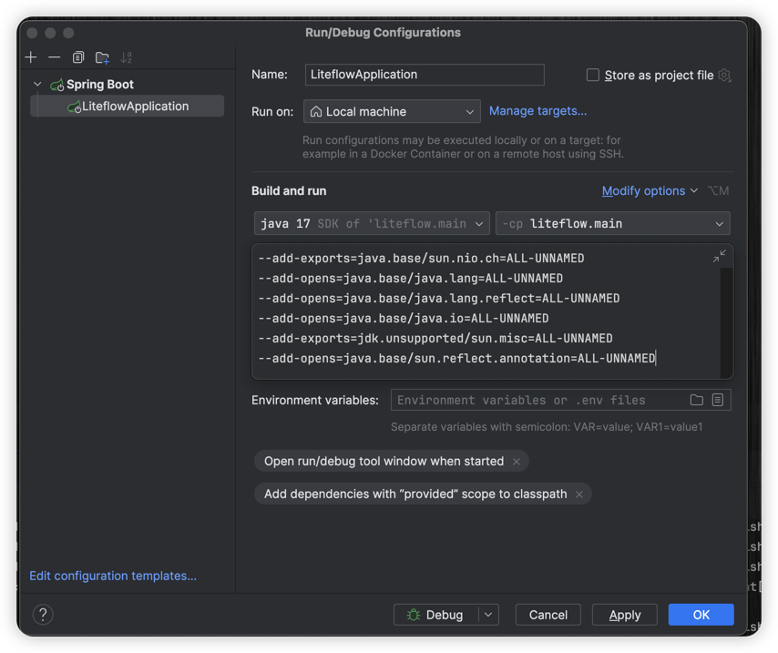
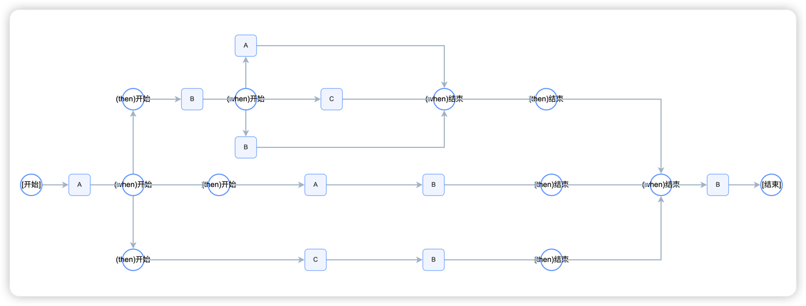
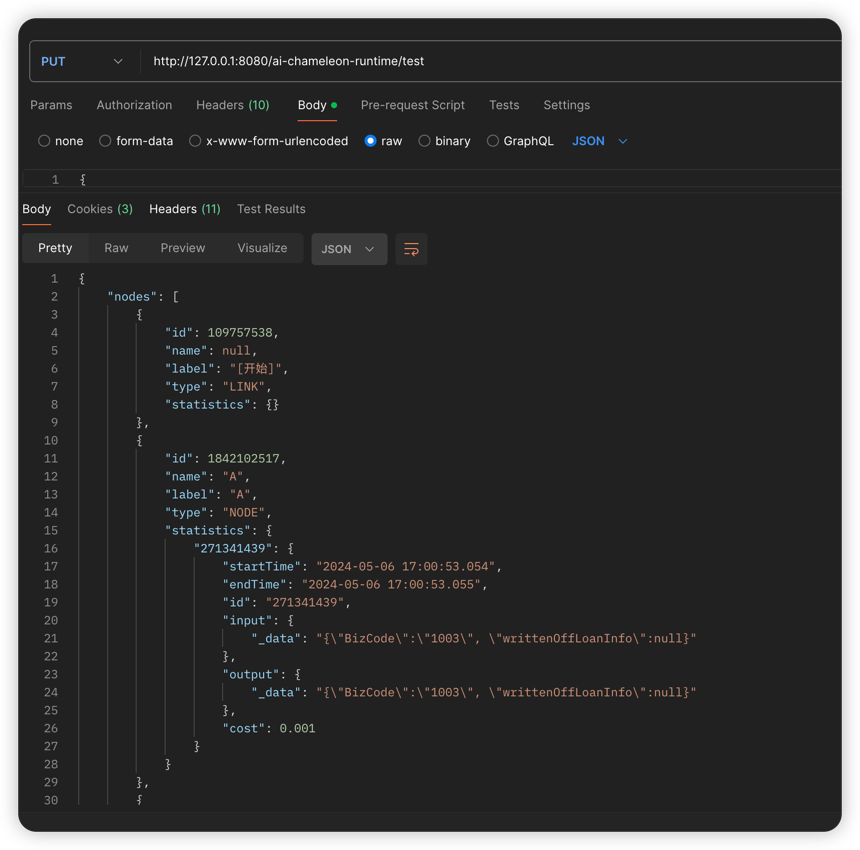

# liteflow-metrics
insight into liteflow runtime AND collect performance information.

此工程仅做验证使用, 如需使用, 请自行修改代码.


后端基于 JDK 17 + Spring Boot 3.2.5 + Liteflow 2.12.0

根目录即是 Java 工程

前端基于 Nextjs + TailwindCSS 构建. 工程在 ./next 目录下

如需验证, 请启动 java 工程, 然后启动前端工程

java 启动时需要增加一些 VM 配置 (JDK17 适配)

```
--add-exports=java.base/sun.nio.ch=ALL-UNNAMED
--add-opens=java.base/java.lang=ALL-UNNAMED
--add-opens=java.base/java.lang.reflect=ALL-UNNAMED
--add-opens=java.base/java.io=ALL-UNNAMED
--add-exports=jdk.unsupported/sun.misc=ALL-UNNAMED
--add-opens=java.base/sun.reflect.annotation=ALL-UNNAMED
```




```shell
cd ./next && yarn dev
```

前端工程会启动在 3000 端口, 访问 http://localhost:3000 即可

前端请求后端接口位于 `./next/src/app/page.tsx` , 请根据需要进行修改

## 实现原理
1. 通过 Chain ID, 从 FlowBus 获取到从 QLExpress 解析后的数据结构信息
2. 分析数据结构, 提取出节点信息 TraceNode, 以及节点之间的关系 TraceEdge, 生成 TraceGraph
3. Liteflow运行时通过 NodeAspect 切面拉取性能信息, 并将性能信息存储在 TraceNode 中, 聚合到 TraceGraph 中
4. 前端使用可视化库, 将 TraceGraph 渲染成流程图

从 Chain ID 转化为 TraceGraph 的核心实现在 TraceGraph 类中


## DEMO 效果
定义的结构是这样的

```java

LiteFlowChainELBuilder.createChain().setChainId("sub1").setEL(
   "PAR(A, B, C)"
).build();
LiteFlowChainELBuilder.createChain().setChainId("sub2").setEL(
        "SER(C, B)"
).build();
LiteFlowChainELBuilder.createChain().setChainId("chain1").setEL(
                    "SER(A, " +
                            "PAR(" +
                            "SER(B, " +
                            "sub1" +
                            "), " +
                            "sub2, " +
                            "SER(A, B)" +
                            "), " +
                            "B" +
                        ")"
).build();

```

以下是根据 Liteflow 的 Chain 提取出来可视化流程图截图


以下是根据 Liteflow 的 Chain 提取出来的性能信息截图


json 数据详情请查看 [output.json](./output.json)